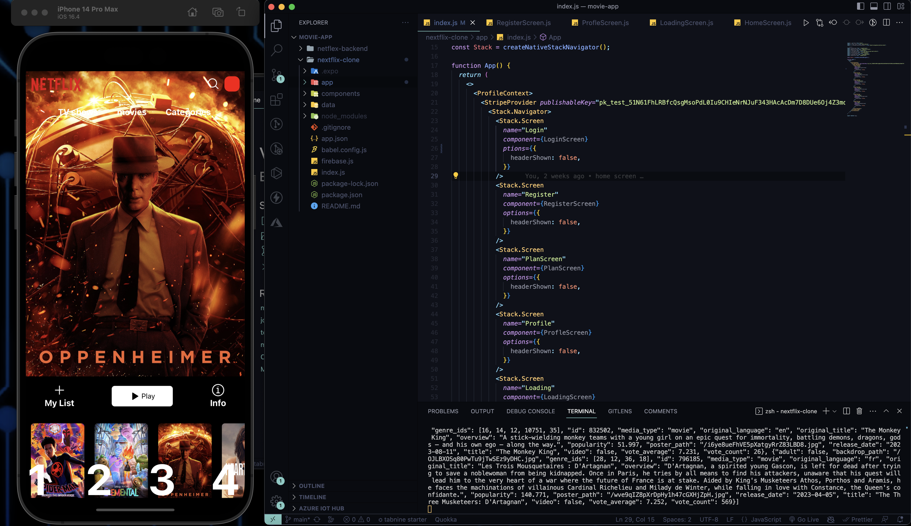

# Netflix Clone mobile app with React native Stripe Integration

## Overview

Welcome to the Netflix Clone with Stripe Integration, your go-to solution for building a streaming platform and handling payments seamlessly. This project allows you to create a Netflix-like application for streaming content while integrating Stripe for payment processing.

## Features

- **Stripe Integration**: Seamlessly process payments for subscription plans with Stripe.
- **User Profiles**: Allow users to create and manage their profiles.
- **Content Library**: Curate a vast library of movies and TV series for your viewers.
- **Responsive Design**: Ensure a great viewing experience on both mobile and tablet devices.

## Getting Started

To get started with this Netflix clone:

1. Clone this repository to your local machine.
2. Install the required dependencies using `npm install`.
3. Set up your Stripe account and configure your API keys.
4. Customize the content library and subscription plans to match your needs.
5. Start the development server with `npm start`.

## Stripe Integration

This Netflix clone includes Stripe integration for handling subscription payments. To set up Stripe:

1. Sign up for a Stripe account at [https://stripe.com](https://stripe.com).
2. Obtain your Stripe API keys (public and secret).
3. Update the Stripe API keys in your project configuration.

## Usage

- Customize the content library by adding your own movies and TV series.
- Configure subscription plans and pricing within the app.
- Test the Stripe payment process using test card details provided by Stripe.

## Contact

Have questions or need assistance with this project? Feel free to reach out to our development team at [Your Email Address]. We're here to help you with any inquiries or issues you may encounter.

